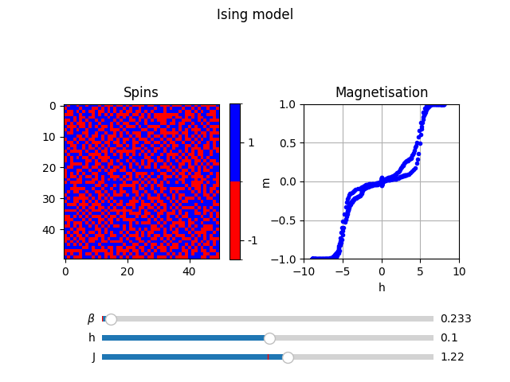

# ISING MODEL 
### About
Numerical simulation of the most well known ferromagnet toy model. This programme carries out a Monte Carlo simulation through the Metropolis algorithm.

### Preview

### How to use
1. Clone the repository and open its folder from the CLI.
1. Run the command `pip install -r requirements.txt` to install dependencies.
Run the command `python main.py` (or `python3 main.py` if both Python 2 and Python 3 are installed on your computer).
You will be prompted to input your desired lattice size and initial fraction of spins pointing up. Press enter after answering each prompt.
1. The programme will open a Matplotlib window with sliders to modify the temperature ($1/\beta$), magnetic field ($h$) and spin coupling ($J$).

### Theory